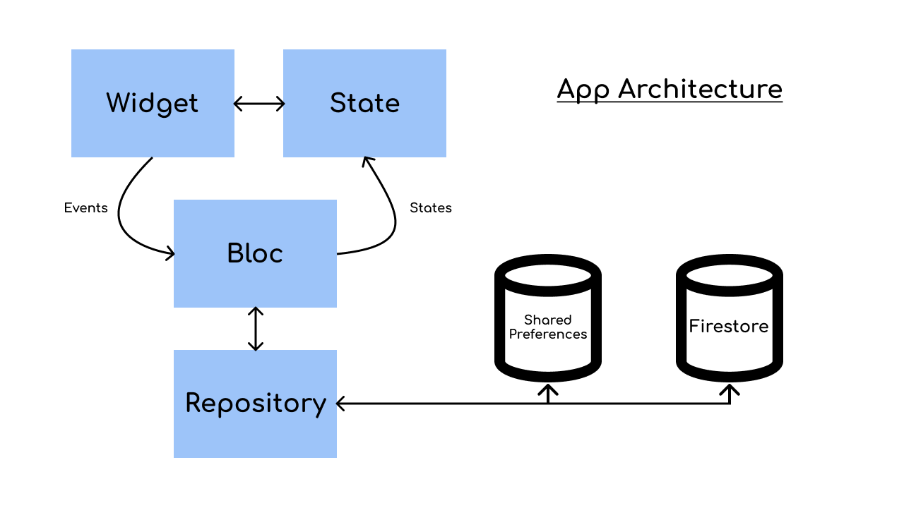

# DigiMess

    
    
    
    
    

An app to help organizations manage their food mess, mainly colleges.
University Android mini project.

## Libraries used
 - [Flutter](https://flutter.dev/)
 - [Firebase Firestore / FlutterFire](https://pub.dev/packages/cloud_firestore)
 - [Flutter bloc](https://pub.dev/packages/flutter_bloc)
 - [Equatable](https://pub.dev/packages/equatable)
 - [Connectivity](https://pub.dev/packages/connectivity)
 - [Shared Preferences](https://pub.dev/packages/shared_preferences)
 - [Keyboard Avoider](https://pub.dev/packages/keyboard_avoider)
 - [Flutter SVG](https://pub.dev/packages/flutter_svg)
 - [Modal Progress HUD](https://pub.dev/packages/modal_progress_hud)
 - [intl](https://pub.dev/packages/intl)
 - [Page Transition](https://pub.dev/packages/page_transition)
 - [crypto](https://pub.dev/packages/crypto)
 - [FL Chart](https://pub.dev/packages/fl_chart)
 - [Flutter local notifications](https://pub.dev/packages/flutter_local_notifications)
 - [share](https://pub.dev/packages/share)
 - [Dots indicator](https://pub.dev/packages/dots_indicator)
 - [pin_code_fields](https://pub.dev/packages/pin_code_fields)
 - [flutter_multi_formatter](https://pub.dev/packages/flutter_multi_formatter)
 - [fluttertoast](https://pub.dev/packages/fluttertoast)

## Architecture

## DB design
[Check out the DB design here](https://github.com/Sharkaboi/DigiMess/blob/main/docs/dbPlan.md)

## Figma design 
[Designs](https://www.figma.com/file/oEDut40fET1EG0NyzC9YeV/DigiMess?node-id=7%3A6)  
[Prototype](https://www.figma.com/proto/oEDut40fET1EG0NyzC9YeV/DigiMess?node-id=7%3A6&scaling=scale-down)

## Trello board
[Task scheduling and management](https://trello.com/b/kPyWzqXt/digimess)
